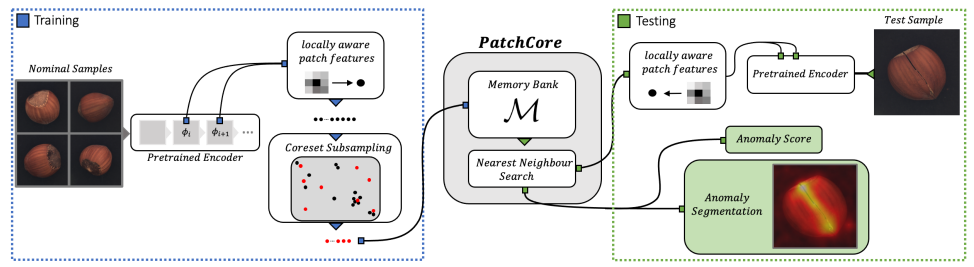
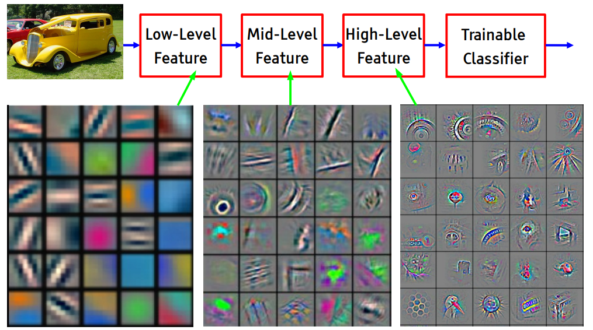

# Anomaly detection in images using anomalib

Anomaly detection aims to identify unusual patterns in (parts of) images using a model that is learned on only "normal" ones. Only requiring normal images to train makes it an attractive approach in many use cases: abnormal images can be quite rare, and in some case we don't even know all unusual patterns that we might encounter so training a supervised model is not an option. One example is the detection of defects in industrial manufacturing, where most defects are rare by definition as production lines are optimized to produce as few of them as possible. Recent approaches for image anomaly detection have shown significant progress on such industrial use cases as demonstrated on the [MVTec dataset](https://www.mvtec.com/company/research/datasets/mvtec-ad), a benchmark dataset with a focus on industrial quality inspection. Following methods such as [SPADE](https://arxiv.org/abs/2005.02357) and [PADiM](https://arxiv.org/abs/2011.08785), researchers from AWS and the University of Tubingen have developed [PatchCore](https://arxiv.org/abs/2106.08265). This method was presented at CVPR 2022, and is the current frontrunner in the field.

In this blogpost we first dive into the inner workings of PatchCore. Next, we apply it to an example in medical imaging to gauge its applicability outside of industrial examples (after all, nothing of the method is specific to industrial use cases). We'll use the [anomalib](https://github.com/openvinotoolkit/anomalib) library for that, which was developed by Intel to provide ready-to-use implementations of most of the prominent methods in the field.

## A quick tour of the PatchCore algorithm

PatchCore extracts locally aware patch features based on normal images, and applies coreset subsampling to construct a memory bank of patch features that describes normal patterns. At testing time, the same patch features are extracted for the test sample and anomaly scores are computed based on a nearest neighbor approach. The following figure from the paper summarizes the approach. Next, we'll zoom in on the most important aspects. 

  Source: [https://arxiv.org/abs/2106.08265](https://arxiv.org/abs/2106.08265)  

### Back to the basics: convolution
To understand PatchCore, we first have to go back to the basics of convolutional neural networks. At its core, a convolutional layer consists of a set of learnable filters, and in a forward pass we slide (or convolve) each of them across the width and height of an input volume computing dot products at each location to produce the output. This is illustrated in the image below.

  Source: [https://cs231n.github.io/convolutional-networks/](https://cs231n.github.io/convolutional-networks/)  

The image shows that each neuron (a circle in the cube) is connected to a local region in the input volume spatially, or in other words to a *patch*. The image shows 5 neurons along the depth, each of them corresponding to a different filter but looking at the same input patch (i.e. they have the same receptive field). Together the outputs of these neurons are a 5-value vector that is a representation of that input patch. The main idea behind PatchCore is to use these patch representations as the basis for anomaly detection.

### Using intermediate ResNet representations

Getting these patch representations requires having a trained network, and obviously we cannot train one on data of our anomaly detection use case as we don't have (sufficient) labeled data. Luckily, many successes of transfer learning have proven that features generated by models pre-trained on ImageNet are generic enough to be used for other tasks as well, and PatchCore does just that.

  Source: [https://pdfs.semanticscholar.org/3154/d217c6fca87aedc99f47bdd6ed9b2be47c0c.pdf](https://pdfs.semanticscholar.org/3154/d217c6fca87aedc99f47bdd6ed9b2be47c0c.pdf)  

As the figure above illustrates, early layers in a deep neural networks learn lower-level features whereas deeper layers learn more high-level features. The PatchCore developers argue that intermediate or mid-level features are most useful for anomaly detection, as early layers can be too generic and final layers can be too heavily based towards ImageNet. For example, when they use a pre-trained ResNet50 model to extract patch representations they only take the outputs of blocks 2 and 3, ignoring the first and last blocks.  

### Constructing a memory bank using coresets

At this point we know that we can extract patch feature maps by applying a pretrained neural network to our input image and storing some of its intermediate outputs (this does capture the main idea but we did omit some aspects like local smoothing, for full details see the [original paper](https://arxiv.org/abs/2106.08265)). PatchCore does this for all "normal" images, and stores the resulting vectors in a so-called memory bank: a large set of vectors that describe what normal image patches look like.  This memory bank quickly becomes quite large: for each input image we can extract a large number of patch representations (*height \* width* of the intermediate feature map). As PatchCore takes a nearest neighbor approach to detect anomalies in the next step, using all patch features would be too expensive for both inference time and storage. To reduce the size of the memory bank but still retain as much information as possible, PatchCore approximates it using coreset subsampling. More precisely, PatchCore uses minimax facility location coreset selection: they select a coreset such that the maximum distance of any instance in the orignal set to the closest instance in the coreset is minimized. In the paper they show that sampling only 1% of the patch representations to be in the memory bank is sufficient to get good performance, which allows them to get inference times below 200ms.

### The anomaly detection step

Based on our memory bank we can now take a nearest neighbour approach to detect anomalies. We can do this at two levels: at the image-level (assigning an anomaly score to the entire image), and at the pixel-level (highlighting the regions in the image that are most anomalous).

To compute the image-level anomaly scores PatchCore first extracts the patch representations of the image to be assessed (i.e. does a forward pass through the pre-trained ResNet network and collecting intermediate outputs), and then takes the maximum distance of any of these patch representations to its closest neighbor from the coreset as the anomaly score. Again, this captures the main idea, there is a bit more to it but to get the full details you can check [the paper](https://arxiv.org/abs/2106.08265). 

Getting pixel-level segmentation maps follows largely the same procedure: for each patch-level representation we can compute the anomaly score as the distance to the closest patch representation from the core set, and realign this score on the original image (as each patch representation corresponds to a specific spatial region in the input image).

## Applying PatchCore to detect signs of diabetic retinopathy

Although PatchCore is introduced as a method for industrial anomaly detection, there is nothing specific to it that would prevent application to other image domains. As it's always interesting to get some hands-on practice with a new method and see how it performs on new data, we trained a PatchCore model on a dataset of healthy retinal images to see how it would perform at detecting signs of diabetic retinopathy in unhealthy retinas. We will be using the IDRiD dataset, which is [publicly available](https://ieee-dataport.org/open-access/indian-diabetic-retinopathy-image-dataset-idrid). Although for this particular use case we would not use anomaly detection (large labeled datasets are available to train supervised models), we can envision other applications in the medical domain where we would (as collecting large sets of images of patients can be impractical, whereas healthy ones are often much easier to collect). This dataset has the advantage that we know which signs of diabetic retinopathy to look for, and these signs manifest in different level of severeness which allows us to get an idea of the sensitivity of the method.  

We used the PatchCore implementation from the [anomalib library](https://github.com/openvinotoolkit/anomalib). You can follow the entire flow in [this notebook](https://todo). 

## Conclusions

