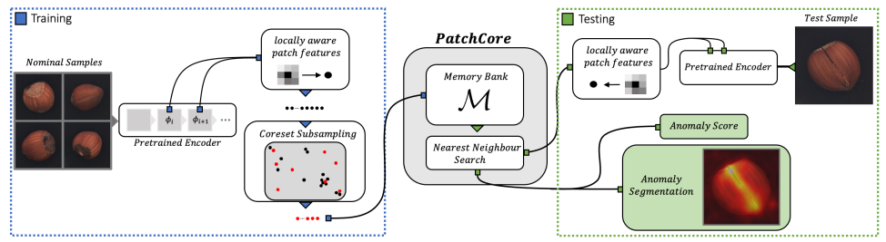

# Anomaly detection in images using anomalib

Anomaly detection aims to find unusual or rare items, deviating significantly from what is considered to be the  "normal" majority. In this blogpost, we look at image anomalies using [PatchCore](https://arxiv.org/abs/2106.08265). Next to indicating which images are anomalous, PatchCore also identifies the most anomalous pixel regions within each image. It only requires normal images images for training, making it attractive for many use cases: abnormal images can be quite rare or expensive to acquire, and in some case we don't even know all unusual patterns that we might encounter so training a supervised model is not an option. One example use case is the detection of defects in industrial manufacturing, where most defects are rare by definition as production lines are optimized to produce as few of them as possible. Recent approaches have made significant progress on this task, as demonstrated on the [MVTec industrial benchmark dataset](https://www.mvtec.com/company/research/datasets/mvtec-ad). [PatchCore](https://arxiv.org/abs/2106.08265), presented at CVPR 2022 by researchers from AWS and the University of Tubingen, is one of the frontrunners in this field. 

In this blogpost we first dive into the inner workings of PatchCore. Next, we apply it to an example in medical imaging to gauge its applicability outside of industrial examples. We use the [anomalib](https://github.com/openvinotoolkit/anomalib) library, which was developed by Intel and offers ready-to-use implementations of many recent image anomaly detection methods.

## A quick tour of the PatchCore algorithm

The following figure from the paper summarizes PatchCore. It extracts locally aware patch features based on normal images, and applies coreset subsampling to construct a memory bank of patch features that describes normal patterns. At testing time, patch features are extracted for the test sample and anomaly scores are computed using a nearest neighbor approach. In the first part of this blogpost, we cover the key steps in a bit more detail.

  Source: [https://arxiv.org/abs/2106.08265](https://arxiv.org/abs/2106.08265)  
 

#### Back to the basics: convolution
To understand PatchCore, we first have to go back to the basics of convolutional neural networks. At its core, a convolutional layer consists of a set of learnable filters, and in a forward pass we slide (or convolve) each of them across the width and height of an input volume computing dot products at each location to produce the output. This is illustrated in the image below.

  Source: [https://cs231n.github.io/convolutional-networks/](https://cs231n.github.io/convolutional-networks/)  
 

The image shows that each neuron (a circle in the cube) is connected to a local region in the input volume, or in other words to a *patch*. The image shows 5 neurons along the depth, each of them corresponding to a different filter but looking at the same input patch (i.e. they have the same receptive field). Together the outputs of these neurons are a 5-value vector that is a representation of that input patch. The main idea behind PatchCore is to use these patch representations as the basis for anomaly detection. The image above shows only a single convolutional layer, but the idea that outputs of neurons along the depth axis in a feature map describe patches from the input image holds for any layer in a deep convolutional network. 

#### Using intermediate ResNet representations

Getting patch representations requires having a trained network, and we cannot train one on data of our anomaly detection use case as we don't have (sufficient) labeled data. Luckily, many successes of transfer learning have proven that features generated by models pre-trained on ImageNet are generic enough to be used for other tasks as well, and PatchCore does just that.

  Source: [https://pdfs.semanticscholar.org/3154/d217c6fca87aedc99f47bdd6ed9b2be47c0c.pdf](https://pdfs.semanticscholar.org/3154/d217c6fca87aedc99f47bdd6ed9b2be47c0c.pdf)  

As the figure above illustrates, early layers in a deep neural networks learn lower-level features whereas deeper layers learn more high-level features. The PatchCore developers argue that intermediate or mid-level features are most useful for anomaly detection, as early layers can be too generic and final layers can be too heavily based towards ImageNet. They use pre-trained ResNet50 models to extract patch representations and only take the outputs of the second and third blocks, ignoring the first and last blocks.  

#### Constructing a memory bank using coresets

So we use intermediate outputs of a pretrained model to represent image patches (this is the key idea, there is a bit more to it as described in the [original paper](https://arxiv.org/abs/2106.08265)). PatchCore does this for all normal images, and stores the resulting vectors in a so-called memory bank: a large set of vectors that describe what normal image patches look like.  This memory bank quickly becomes quite large, as for each input image we can extract a large number of patch representations (*height \* width* for  each intermediate feature map that we want to include). As PatchCore takes a nearest neighbor approach to detect anomalies in the next step, using all patch features would be too expensive for both inference time and storage. To reduce the size of the memory bank but still retain as much information as possible, PatchCore approximates it using coreset subsampling. More precisely, PatchCore uses minimax facility location coreset selection: they select a coreset such that the maximum distance of any instance in the original set to the closest instance in the coreset is minimized. In the paper they show that sampling only 1% of the patch representations to be in the memory bank is sufficient to get good performance, which allows them to get inference times below 200ms.

#### The anomaly detection step

Based on the memory bank we can now take a nearest neighbour approach to detect anomalies. We can do this at two levels: we can assign an anomaly score to the entire image, or highlight pixel-level regions in each image that are most anomalous. 
To compute the image-level anomaly scores, PatchCore first extracts the patch representations of the image to be assessed (i.e. does a forward pass through the pre-trained ResNet network and collects intermediate outputs) and then takes the maximum distance of any of these patch representations to its closest neighbor from the coreset as the anomaly score. Again, there is a bit more to it (see [the paper](https://arxiv.org/abs/2106.08265)) but this captures the main idea. 
Getting pixel-level segmentation maps follows largely the same procedure: for each patch-level representation we can compute the anomaly score as the distance to the closest patch representation from the core set, and realign this score on the original image (as each patch representation corresponds to a specific spatial region in the input image).

## Applying PatchCore to detect signs of diabetic retinopathy

Although PatchCore is introduced as a method for industrial anomaly detection, there is nothing specific to it that would prevent application to other image domains. As it's always interesting to get some hands-on practice with a new method and see how it performs on new data, we trained a PatchCore model on a dataset of healthy retinal images to see how it performs at detecting signs of diabetic retinopathy in unhealthy retinas. We use the PatchCore implementation from the [anomalib library](https://github.com/openvinotoolkit/anomalib), and you can perform similar experiments by following [our notebook](https://https://github.com/toon-vc/anomalib-demo/blob/main/anomalib_demo.ipynb). 

We will be using the IDRiD dataset, which is [publicly available](https://ieee-dataport.org/open-access/indian-diabetic-retinopathy-image-dataset-idrid). Although for this particular use case we would not use anomaly detection in practice (large labeled datasets are available to train supervised models), this dataset has the advantage that we know which signs of diabetic retinopathy to look for, and these signs manifest in different level of severeness which allows us to get an idea of the sensitivity of the method. We can envision other applications in the medical domain where an anomaly detection approach would be suited, as collecting large sets of images of patients is often impractical and healthy ones are often much easier to collect. 

Before looking at some affected retinas, let's first get a sense of what healthy ones look like. The image below shows two retinas without any sign of diabetic retinopathy. We see the normal structure of the retina, including the optic disk (the bright spot, where blood vessels and nerves enter the eye) and macula (the dark spot where no blood vessels run through, responsible for high-resolution vision).

 Source: images from the IDRiD dataset 

Now that we have an idea of what a healthy retina looks like, we can take a look at PatchCore's result on some retinas with severe diabetic retinopathy. Note that the model is trained on only 168 healthy retinas, and we did not do any hyperparameter tuning. In the two retinas in the image below we see that the model already quite accurately identifies the exudates (lipids ands proteins leaking through damaged retinal vessels), which is impressive as we only showed it a small set of healthy retinas and it has never seen any exudates during training. 

Of course, the model is still far from perfect. Below we see two retinas where it wrongly identifies the optic disk as being anomalous. In general, in absence of very clear anomalies we see that higher anomaly scores are given to both the optic disk and areas with a lot of vessels. It is likely that our relatively small training set did not capture enough variation. 

Note that we have taken the IDRiD dataset here as an example allowing us to quickly demonstrate PatchCore in a new domain, but of course an in-depth study would have much more to cover (eg. finding small and subtle microaneurysms). Doing a more extensive study with a larger dataset (eg. [the Kaggle DR dataset](https://www.kaggle.com/c/diabetic-retinopathy-detection/data)) and verifying PatchCore's detection capabilities and limitations on all kinds of damages inflicted by diabetic retinopathy would be highly interesting, but is out of the scope of this blogpost.

## Wrap-up

We have covered the key concepts of PatchCore, and applied it to a medical imaging dataset. Even with a very limited dataset, we saw some quite promising results. In general, if you have a use case where normal data is easy to acquire but abnormal data is expensive (or even unknown a priori), anomalib might be a good candidate to consider.

